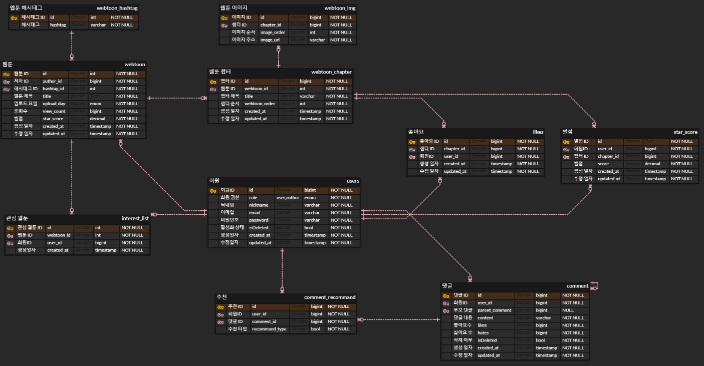

# 웹툰 서비스 만들기

일반적인 웹툰 서비스를 간략화한 웹툰 서비스입니다.

## 프로젝트 기능 및 설계
- 회원가입 기능
    - 사용자는 회원가입을 할 수 있다. 일반적으로 모든 사용자는 회원가입시 USER 권한 (일반 권한)을 지닌다.
    - 회원가입시 이메일, 패스워드, 닉네임을 입력받으며, 아이디는 unique 해야한다.
    - 일반 로그인으로 회원가입을 진행할 시 메일을 전송하여 인증 후 회원가입이 진행된다.
    - 소셜 로그인의 경우 프로세스진행 후 회원가입 진행된다.

- 로그인 기능
    - 사용자는 로그인을 할 수 있다. 로그인시 회원가입때 사용한 아이디와 패스워드가 일치해야한다.
    - 소셜로그인의 경우 토큰을 받아 로그인을 진행한다.
    - 성공적으로 로그인 한 후에는 token을 송신한다.

- 회원 탈퇴
    - 로그인 한 사용자는 회원탈퇴를 진행할 수 있다.
    - 회원 삭제는 회원 탈퇴가 진행된 일주일 후에 진행된다.

- 웹툰 열람 기능
    - 로그인한 사용자는 권한에 관계 없이 웹툰을 열람할 수 있다.
    - 원하는 웹툰의 이름과 챕터로 특정 웹툰을 열람할 수 있다.
    - 요일별, 조회순, 별점순, 카테고리순으로 조회할 수 있다.

- 웹툰 삭제 기능
    - 업로드한 사용자만 자신의 웹툰을 삭제할 수 있다.

- 웹툰 댓글 달기
    - 로그인한 사용자는 원하는 웹툰의 챕터에 댓글을 달 수 있다.
    - 작성된 댓글에 대댓글을 작성할 수 있다.

- 웹툰 작성 기능
    - AUTHOR 권한을 가진 사용자만 웹툰을 업로드할 수 있다.
    - 웹툰을 업로드하기 전 웹툰을 생성한 후에 챕터별로 웹툰을 업로드 할 수 있다.

- 관심 웹툰 기능
    - 사용자는 원하는 웹툰을 관심 웹툰으로 지정할 수 있다.
    - 관심 웹툰으로 지정한 웹툰이 업로드시 사용자에게 알람이 송신된다.
- 작가 등록
  - 사용자가 작가로 등록할 시 AUTHOR role을 부여한다.

## ERD

## Trouble Shooting
[go to the trouble shooting section](doc/TroubleShooting.md)

### Tech Stack

 
   
  
  
   
  
  
  

